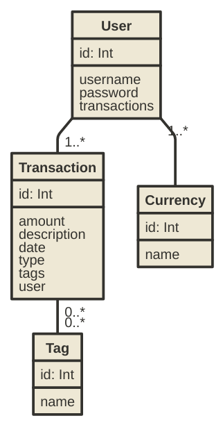

# Dokumentáció

## Pénzkezelő

Készítette: Ágoston Barnabás

### 1. Követelményanalízis

#### 1.1. Célkitűzés, projektindító dokumentum

A program legfőbb célja jól átláthatóan, és érthetően megjeleníteni az adott tranzakciókat és az egyenleget egy webes vastagkliens, azaz egyoldali alkalmazás felhasználásával. Az adatok védelme érdekében legyen lehetőség regisztrációra, majd bejelentkezésre. Bejelentkezett felhasználó a tranzakciók listáját megtekintheti, bővítheti, meglévő elemeket törölhet.

##### Funkcionális követelmények:

* Regisztráció
* Bejelentkezés
* Csak bejelentkezett felhasználók által elérhető funkciók
  - egyenleg megtekintése
  - profiladatok szerkesztése
  - meglévő tranzakciók listázása
  - meglévő tranzakció szerkesztése
  - meglévő tranzakció törlése
  - új tranzakció felvételére a listába
  - meglévő címkék listázása
  - meglévő címke szerkesztése
  - meglévő címke törlése
  - új címke felvételére a listába

##### Nem funkcionális követelmények:

* **Könnyű áttekinthetőség:** Színekkel típus szerint csoportosítás
* **Használhatóság:** Könnyű áttekinthetőség, ésszerű elrendezés, könnyen kezelhetőség
* **Megbízhatóság:** jelszóval védett funkciók, és a jelszavak védelme a háttérben. Hibásan bevitt adatok esetén a program jól láthatóan jelezzen a felhasználónak, és emelje ki a hibás beviteli mezőket. A jól bevitt adatok maradjanak az űrlapban.
* **Karbantarthatóság:** könnyen lehessen bővíteni, a különböző típusú fájlok külön csoportosítva, ésszerűen legyenek felbontva, a könnyebb fejleszthetőség miatt

#### 1.2. Szakterületi fogalomjegyzék

* **tranzakció**: ügylet, művelet

#### 1.3. Használatieset-modell, funkcionális követelmények

**Vendég**: Csak a publikus oldalakat éri el

* Főoldal
* Bejelentkezés
* Regisztráció

**Bejelentkezett felhasználó**: A publikus oldalak elérésén felül egyéb funkciókhoz is hozzáfér.

* Egyenleg megtekintése
* Profiladatok szerkesztése
* Meglévő tranzakciók megtekintése
* Meglévő tranzakció szerkesztése
* Meglévő tranzakció törlése
* Új tranzakció felvétele
* Meglévő kategória szerkesztése
* Meglévő kategória törlése
* Új kategória felvétele
* Meglévő címkék megtekintése
* Meglévő címke szerkesztése
* Meglévő címke törlése
* Új címke felvétele


**Meglévő tranzakció szerkesztése:**

1. A felhasználó az oldalra érkezve, bejelentkezik vagy regisztrál
2. Regisztráció után megtekintheti a tranzakciókat listázó oldalt, ahol kiválaszthatja a szerkeszteni kívánt tranzakciót.
3. Megnyomja a „Szerkesztés” gombot
4. A szerkesztés oldalon felviszi az új adatokat
5. A „Mentés” gombra kattintva elmenti a változásokat


**Meglévő címke szerkesztése:**

1. A felhasználó az oldalra érkezve, bejelentkezik vagy regisztrál
2. Regisztráció után megtekintheti a címkéket listázó oldalt, ahol kiválaszthatja a szerkeszteni kívánt címkét.
3. Megnyomja a „Szerkesztés” gombot
4. A szerkesztés oldalon felviszi az új adatokat
5. A „Mentés” gombra kattintva elmenti a változásokat


### 2. Tervezés

#### 2.1. Architektúra terv

##### 2.1.1. Komponensdiagram


##### 2.1.2. Oldaltérkép:

**Publikus:**
* Főoldal
* Bejelentkezés
* Regisztráció

**Bejelentkezett:**
* Főoldal
* Profiladatok szerkesztése
* Tranzakciók
  * Tranzakció szerkesztése
  * Tranzakció törlése
  * Új tranzakció felvétele
* Címkék
  * Címke szerkesztése
  * Címke törlése
  * Új címke felvétele

##### 2.1.3. Végpontok

* GET/: főoldal
* GET/login: bejelentkező oldal
* POST/login: bejelentkező adatok felküldése
* GET/login/signup: regisztrációs oldal
* POST/login/signup: regisztrációs adatok felküldése
* GET/logout: kijelentkező oldal
* GET/users/edit=id: profiladatok módosítása
* POST/users/edit=id: profiladatok módosítása, adatok felküldése
* GET/transactions/list: tranzakció listaoldal
* GET/transactions/new: új tranzakció felvétele
* POST/transactions/new: új tranzakció felvételéhez szükséges adatok felküldése
* GET/transactions/delete=id: tranzakció törlése
* GET/transactions/edit=id: tranzakció módosítása
* POST/transactions/edit=id: tranzakció módosítása, adatok felküldése
* GET/tags/list: címke listaoldal
* GET/tags/new: új címke felvétele
* POST/tags/new: új címke felvételéhez szükséges adatok felküldése
* GET/tags/delete=id: címke törlése
* GET/tags/edit=id: címke módosítása
* POST/tags/edit=id: címke módosítása, adatok felküldése

#### 2.2. Felhasználói-felület modell

##### 2.2.1.Oldalvázlatok:

**Főoldal kijelentkezve**


**Főoldal bejelentkezve**


**Regisztrációs oldal**


**Bejelentkező oldal**


**Profiladatok szerkesztése**


**Tranzakció listaoldal**


**Új tranzakció felvétele**


**Tranzakció szerkesztése**


**Címke listaoldal**


**Új címke felvétele**


**Címke szerkesztése**


##### 2.2.2. Designtervek (végső megvalósítás kinézete):

**Főoldal kijelentkezve**


**Főoldal bejelentkezve**


**Regisztrációs oldal**


**Bejelentkező oldal**


**Profiladatok szerkesztése**


**Tranzakció listaoldal**


**Új tranzakció felvétele**


**Tranzakció szerkesztése**


**Címke listaoldal**


**Új címke felvétele**


**Címke szerkesztése**


##### 2.2.3. Osztálymodell

**Adatmodell**


**Adatbázisterv**



##### 2.2.4. Dinamikus működés

**Szekvenciadiagram**

Vegyünk példának a regisztrációt, majd egy új elem felvételét, szerkesztését, törlését, mindezt szekvenciadiagrammon.


### 3. Implementáció

##### 3.1.1. Fejlesztőkörnyezet

Github's Atom Editor

##### 3.1.2. Könyvtárstruktúra, funkciók

* **ckd193-beadando1**
  * **config**
    * _waterline.js_
  * **controllers**
    * _index.js_
    * _transactions.js_
    * _login.js_
  * **models**
    * _transactions.js_
    * _transactions.test.js_
    * _tags.js_
    * _tags.test.js_
    * _currencies.js_
    * _currencies.test.js_
    * _user.js_
    * _user.test.js_
  * **views**: handlebars (hbs) fájlok
    * **login**
      * _index.hbs_
      * _signup.hbs_
    * **transactions**
      * _new.hbs_
      * _edit.hbs_
      * _list.hbs_
    * _index.hbs_
    * _layout.hbs_
  * _bower.json_
  * _package.json_
  * _server.js_

### 4. Tesztelés

#### 4.1. Tesztelési környezetek

Kétféle tesztelési módszert használunk a program teljeskörű tesztelésére. Először egységteszteket végzünk a mocha keretrendszer és a chai ellenőrző könyvtár segítségével. Egységtesztelés közben a modellek működését, a problémamentes funkciókat és műveleteket ellenőrizzük.
Másodszor a funkcionális tesztelés segítségével a végpontokat ellenőrizzük, a megfelelő tartalom megjelenését, és az oldalak működőképességét.

#### 4.2. Egységteszt

Kiválasztjuk a tesztelni kívánt modelt (ezesetben a user modelt), és létrehozunk hozzá egy tesztelő fájlt.
Legyen ez most a: **_user.test.js_**

Hozzuk létre az abstract modellréteget (ORM), majd vegyük sorra a teszteseteket.

Regisztráció tesztelése: user létrehozása

```javascript
it('should be able to create a user', function () {
  return User.create(getUserData())
  .then(function (user) {
    expect(user.felhnev).to.equal('abcdef');
    expect(bcrypt.compareSync('jelszo', user.password)).to.be.true;
    expect(user.surname).to.equal('Gipsz');
    expect(user.forename).to.equal('Jakab');
    expect(user.avatar).to.equal('');
  });
});
```

Jelszó ellenőrzése, helyes és hibás jelszó esetén

```javascript
describe('# validPassword', function() {
  it('should return true with right password', function() {
    return User.create(getUserData()).then(function(user) {
      expect(user.validPassword('jelszo')).to.be.true;
    })
  });
  it('should return false with wrong password', function() {
    return User.create(getUserData()).then(function(user) {
      expect(user.validPassword('titkos')).to.be.false;
    })
  });
});
```

#### 4.3. Funkcionális teszetelés

Válasszuk ki a tesztelni kívánt modelt (ezesetben transactions), és hozzuk létre hozzá a tesztelő fájlt. Nevezzük el: **_transactions.test.js_**

Teszteljük sorban az egyes végpontok működését. Vegyünk most példának egy végpontot, és egy funkció működését:

Új tranzakció oldal elérése:
```javascript
it('should go the transaction page', function () {
  return browser.visit('/transactions/new')
  .then(function () {
    browser.assert.success();
    browser.assert.text('div.page-header > h1', 'Új tranzakció felvétele');
  });
});
```
Sikeres bejelentkezés a megfelelő adatokkal:
```javascript
it('should be able to login with correct credentials', function (done) {
  browser
  .fill('felhnev', 'Ellasandra')
  .fill('password', 'titkos')
  .pressButton('button[type=submit]')
  .then(function () {
    browser.assert.redirected();
    browser.assert.success();
    browser.assert.url({ pathname: '/transactions/list' });
    done();
  });
});
```

A tesztfájl lefuttatásához használt parancs: `npm test`

Sikeres tesztek lefutása után az alábbi üzenetet kell kapjuk:

```shell
> @ test /home/ubuntu/workspace/ckd193-beadando1
> node_modules/mocha/bin/mocha **/*.test.js

  User visits index page
    ✓ should be successful
    ✓ should see welcome page

  User visits new transaction page
    ✓ should go to the authentication page
    ✓ should be able to login with correct credentials (1706ms)
    ✓ should go the transaction page (154ms)

  UserModel
    ✓ should work
    ✓ should be able to create a user (536ms)
    ✓ should be able to find a user (514ms)
    ✓ should be able to update a user (524ms)
    # validPassword
      ✓ should return true with right password (493ms)
      ✓ should return false with wrong password (486ms)

  11 passing (5s)
```

#### 4.4.Tesztesetek

* Főoldal láthatósága
* Felhasználó létrehozása
* Felhasználó módosítása
* Bejelentkezés jó, és rossz jelszóval
* Sikeres bejelentkezés
* Csak bejelentkezett felhasználó által látható oldal láthatósága
* Új tranzakció felvétele oldal láthatósága

### 5. Felhasználói dokumentáció

**Futtatáshoz szükséges operációs rendszer:** Tetszőleges operációs rendszer

**A futtatáshoz szükséges hardver:** Operációs rendszerek szerint megadva

**Egyéb követelmények:** modern böngésző

**Program használata:**

1. Böngészőben nyissuk meg a főoldalt
2. Regisztráljunk vagy jelentkezzünk be
3. Bejelentkezés/Regisztráció után a főoldalon látjuk az egyenleget és a kiadás/bevétel statisztikát
4. A navigációs menüben kiválasztva a tranzakciókat elérhetjük a tranzakciók listáját
5. Lista oldalon: Az új tranzakció gombra kattintva hozzaádhatunk újabb tranzakciókat
5. Töltsük ki az űrlapot
6. Hibás adatok esetén az űrlap jelezni fogja a hibát
7. A hozzáadás gombra kattintva mentsük el az adatokat
8. Lista oldalon: Törlés gombra kattintva törölhetjük a tranzakciót
9. Lista oldalon: A szerkesztés gombra kattintva a szerkesztés oldalra jutunk
10. Szerkesztés oldal: megegyezik az új tranzakció felvitel funkcióval, csak előre láthatóak benne a tranzakció eddigi adatai

### 6. Irodalomjegyzék:

* http://webprogramozas.inf.elte.hu/alkfejl.php
* http://ade.web.elte.hu/wabp/lecke2_lap1.html
* http://webprogramozas.inf.elte.hu/alkfejl/A_dokumentacio_felepitese.pdf
