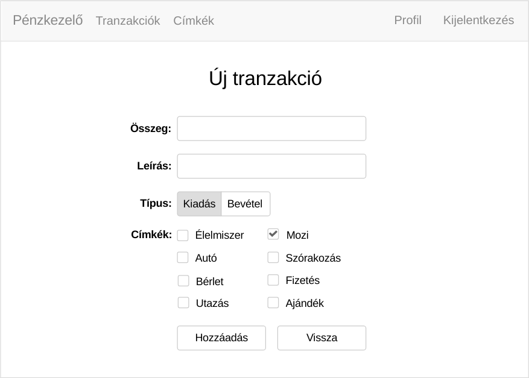
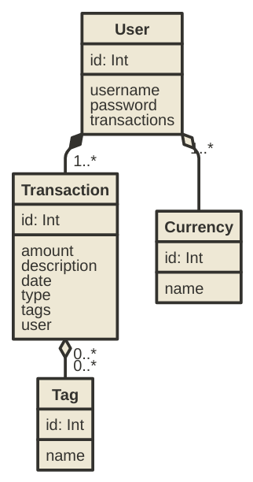

# Dokumentáció

## Pénzkezelő

Készítette: Ágoston Barnabás

### 1. Követelményanalízis

#### 1.1. Célkitűzés, projektindító dokumentum

A program legfőbb célja jól átláthatóan, és érthetően megjeleníteni az adott tranzakciókat és az egyenleget egy webes vastagkliens, azaz egyoldali alkalmazás felhasználásával. Az adatok védelme érdekében legyen lehetőség regisztrációra, majd bejelentkezésre. Bejelentkezett felhasználó a tranzakciók listáját megtekintheti, bővítheti, meglévő elemeket törölhet.

##### Funkcionális követelmények:

###### Általános funkciók

* Regisztráció
* Bejelentkezés
* Csak bejelentkezett felhasználók által elérhető funkciók
  - egyenleg megtekintése
  - profiladatok szerkesztése
  - meglévő tranzakciók listázása
  - meglévő tranzakció szerkesztése
  - meglévő tranzakció törlése
  - új tranzakció felvételére a listába
  - tranzakciók szűrése/keresése
  - meglévő címkék listázása
  - meglévő címke szerkesztése
  - meglévő címke törlése
  - új címke felvételére a listába

###### Kliens oldali JavaScript-tel elérhető funkciók

* AJAX diagram frissítés adott időközönként
* AJAX tranzakció keresés
* AJAX tranzakció törlés
* AJAX címke törlés
* Modális megerősítés kérés:
  - tranzakció törlésről
  - címke törlésről
  - felhasználói profil törlésről
* Kliens oldali form validálás:
  - bejelentkezésnél
  - regisztrációnál
  - új tranzakció felvételénél
  - tranzakció szerkesztésénél
  - új címke felvételénél
  - címke szerkesztésénél

##### Nem funkcionális követelmények:

* **Könnyű áttekinthetőség:** Színekkel típus szerint csoportosítás
* **Használhatóság:** Könnyű áttekinthetőség, ésszerű elrendezés, könnyen kezelhetőség
* **Megbízhatóság:** jelszóval védett funkciók, és a jelszavak védelme a háttérben. Hibásan bevitt adatok esetén a program jól láthatóan jelezzen a felhasználónak, és emelje ki a hibás beviteli mezőket. A jól bevitt adatok maradjanak az űrlapban.
* **Karbantarthatóság:** könnyen lehessen bővíteni, a különböző típusú fájlok külön csoportosítva, ésszerűen legyenek felbontva, a könnyebb fejleszthetőség miatt

#### 1.2. Szakterületi fogalomjegyzék

* **tranzakció**: ügylet, művelet

#### 1.3. Használatieset-modell, funkcionális követelmények

**Vendég**: Csak a publikus oldalakat éri el

* Főoldal
* Bejelentkezés
* Regisztráció

**Bejelentkezett felhasználó**: A publikus oldalak elérésén felül egyéb funkciókhoz is hozzáfér.

* Egyenleg megtekintése
* Profiladatok szerkesztése
* Profil törlése
* Meglévő tranzakciók megtekintése
* Meglévő tranzakció szerkesztése
* Meglévő tranzakció törlése
* Új tranzakció felvétele
* Tranzakciók szűrése
* Meglévő címkék megtekintése
* Meglévő címke szerkesztése
* Meglévő címke törlése
* Új címke felvétele


**Meglévő tranzakció szerkesztése:**

1. A felhasználó az oldalra érkezve, bejelentkezik vagy regisztrál
2. Regisztráció után megtekintheti a tranzakciókat listázó oldalt, ahol kiválaszthatja a szerkeszteni kívánt tranzakciót.
3. Megnyomja a „Szerkesztés” gombot
4. A szerkesztés oldalon felviszi az új adatokat
5. A „Mentés” gombra kattintva elmenti a változásokat


**Meglévő címke szerkesztése:**

1. A felhasználó az oldalra érkezve, bejelentkezik vagy regisztrál
2. Regisztráció után megtekintheti a címkéket listázó oldalt, ahol kiválaszthatja a szerkeszteni kívánt címkét.
3. Megnyomja a „Szerkesztés” gombot
4. A szerkesztés oldalon felviszi az új adatokat
5. A „Mentés” gombra kattintva elmenti a változásokat


### 2. Tervezés

#### 2.1. Architektúra terv

##### 2.1.1. Komponensdiagram


##### 2.1.2. Oldaltérkép:

**Publikus:**
* Főoldal
* Bejelentkezés
* Regisztráció

**Bejelentkezett:**
* Főoldal
* Profiladatok szerkesztése
* Tranzakciók
  * Tranzakció szerkesztése
  * Tranzakció törlése
  * Új tranzakció felvétele
  * Tranzakciók szűrése
* Címkék
  * Címke szerkesztése
  * Címke törlése
  * Új címke felvétele

##### 2.1.3. Végpontok

Típus  | URL | Leírás
-------|-----|-------
GET    | / | főoldal
GET    | /login | bejelentkező oldal
POST   | /login | bejelentkező adatok felküldése
GET    | /signup | regisztrációs oldal
POST   | /signup | regisztrációs adatok felküldése
GET    | /logout | kijelentkező oldal
GET    | /user/edit | profiladatok módosítása
POST   | /user/edit | profiladatok módosítása, adatok felküldése
POST   | /user/delete | felhasználói profil törlése
GET    | /transactions | tranzakció listaoldal
GET    | /transactions/create | új tranzakció felvétele
POST   | /transactions/create | új tranzakció felvételéhez szükséges adatok felküldése
POST   | /transactions/:id/delete | tranzakció törlése
DELETE | /ajax/transactions/:id/delete | ajax tranzakció törlés
GET    | /transactions/:id/edit | tranzakció módosítása
POST   | /transactions/:id/edit | tranzakció módosítása, adatok felküldése
POST   | /ajax/getTransactionRows | ajax tranzankció lista lekérése (szűrővel)
GET    | /tags/list | címke listaoldal
GET    | /tags/create | új címke felvétele
POST   | /tags/create | új címke felvételéhez szükséges adatok felküldése
POST   | /tags/:id/delete | címke törlése
DELETE | /ajax/tags/:id/delete | ajax címke törlés
GET    | /tags/:id/edit | címke módosítása
POST   | /tags/:id/edit | címke módosítása, adatok felküldése

#### 2.2. Felhasználói-felület modell

##### 2.2.1.Oldalvázlatok:

**Főoldal kijelentkezve**


**Főoldal bejelentkezve**


**Regisztrációs oldal**


**Bejelentkező oldal**


**Profiladatok szerkesztése**


**Tranzakció listaoldal**


**Új tranzakció felvétele**



**Tranzakció szerkesztése**


**Címke listaoldal**


**Új címke felvétele**


**Címke szerkesztése**


##### 2.2.2. Designtervek (végső megvalósítás kinézete):

**Főoldal kijelentkezve**


**Főoldal bejelentkezve**


**Regisztrációs oldal**


**Bejelentkező oldal**


**Profiladatok szerkesztése**


**Tranzakció listaoldal**


**Új tranzakció felvétele**


**Tranzakció szerkesztése**


**Címke listaoldal**


**Új címke felvétele**


**Címke szerkesztése**


##### 2.2.3. Osztálymodell

**Adatmodell**



**Adatbázisterv**


##### 2.2.4. Dinamikus működés

**Szekvenciadiagram**

Vegyünk példának a regisztrációt, majd egy új elem felvételét, szerkesztését, törlését, mindezt szekvenciadiagrammon.


### 3. Implementáció

##### 3.1.1. Fejlesztőkörnyezet

Github's Atom Editor

##### 3.1.2. Könyvtárstruktúra, funkciók

- penzkezelo
  - app
    - Commands
       - Greet.js
    - Http
       - Controllers
       - TagController.js
       - TransactionController.js
       - UserController.js
       - Middleware
       - kernel.js
       - routes.js
    - Listeners
       - Http.js
    - Model
      - Hooks
        - User.js
      - Currency.js
      - Tag.js
      - Token.js
      - Transaction.js
      - User.js
  - config
    - app.js
    - auth.js
    - bodyParser.js
    - cors.js
    - database.js
    - event.js
    - session.js
    - shield.js
  - database
    - migrations
       - 1477925627080_create_users_table.js
       - 1477925627081_create_tokens_table.js
       - 1477925692019_transactions.js
       - 1477933872549_tags.js
       - 1477934112817_currencies.js
       - 1478008834360_transaction_tag.js
    - seeds
       - Database.js
    - development.sqlite
    - factory.js
  - public
    - js
      - Chart.bundle.min.js
      - bootstrap-validator.min.js
      - bootstrap.min.js
      - jquery.min.js
      - tags.js
      - transactions.js
      - updateChart.js
      - user.js
  - resources
    - views
      - errors
        - 401.njk
        - 404.njk
        - index.njk
      - createTag.njk
      - createTransaction.njk
      - editTag.njk
      - editTransaction.njk
      - editUser.njk
      - index.njk
      - login.njk
      - master.njk
      - signup.njk
      - tags.njk
      - transactionRows.njk
      - transactions.njk
  - test
    - delete-tag.html
    - delete-transaction.html
    - login-failure.html
    - login-success.html
    - tests.html
  - package.json
  - server.js

### 4. Tesztelés

#### 4.1. Tesztesetek

* Oldalak láthatósága (bejelentkezve, kijelentkezve)
* Bejelentkezés hibás adatokkal
* Sikeres bejelentkezés
* Profiladatok szerkesztése
* Profil törlése
* Tranzakció szerkesztése
* Tranzakció törlése
* Új tranzakció felvétele
* Címke szerkesztése
* Címke törlése
* Új címke felvétele

#### 4.2. Funkcionális teszetelés

##### Sikertelen bejelentkezés

Command                | Target              | Value
-----------------------|---------------------|------
`open`                 | `/login`            |
`type`                 | `name=username`     | `x`
`type`                 | `name=password`     | `y`
`clickAndWait`         | `name=login`        |
`assertElementPresent` | `css=.alert-danger` |

##### Sikeres bejelentkezés

Command                | Target           | Value
-----------------------|------------------|------
`open`                 | `/login`         |
`type`                 | `name=username`  | `test`
`type`                 | `name=password`  | `test`
`clickAndWait`         | `name=login`     |
`assertElementPresent` | `id=logout-link` |

##### Tranzakció törlés

Command              | Target            | Value
---------------------|-------------------|------
`open`               | `/transactions`   |
`storeAttribute`     | `xpath=//form[contains(@class, 'delete-transaction-form')]@data-id` | `id`
`click`              | `css=.delete-btn` |
`click`              | `css=.modal-ok`   |
`verifyNotAttribute` | `xpath=//form[contains(@class, 'delete-transaction-form')]@data-id` | `${id}`

##### Címke törlés

Command              | Target            | Value
---------------------|-------------------|------
`open`               | `/transactions`   |
`storeAttribute`     | `xpath=//form[contains(@class, 'delete-tag-form')]@data-id` | `id`
`click`              | `css=.delete-btn` |
`click`              | `css=.modal-ok`   |
`verifyNotAttribute` | `xpath=//form[contains(@class, 'delete-tag-form')]@data-id` | `${id}`

##### Tesztek kimenete

```
[info] Playing test case login-failure
[info] Executing: |open | /login | |
[info] Executing: |type | name=username | x |
[info] Executing: |type | name=password | y |
[info] Executing: |clickAndWait | name=login | |
[info] Executing: |assertElementPresent | css=.alert-danger | |
[info] Test case passed

[info] Playing test case login-success
[info] Executing: |open | /login | |
[info] Executing: |type | name=username | test |
[info] Executing: |type | name=password | test |
[info] Executing: |clickAndWait | name=login | |
[info] Executing: |assertElementPresent | id=logout-link | |
[info] Test case passed

[info] Playing test case delete-transaction
[info] Executing: |open | /transactions | |
[info] Executing: |storeAttribute | xpath=//form[contains(@class, 'delete-transaction-form')]@data-id | id |
[info] Executing: |click | css=.delete-btn | |
[info] Executing: |click | css=.modal-ok | |
[info] Executing: |verifyNotAttribute | xpath=//form[contains(@class, 'delete-transaction-form')]@data-id | ${id} |
[info] Test case passed

[info] Playing test case delete-tag
[info] Executing: |open | /tags | |
[info] Executing: |storeAttribute | xpath=//form[contains(@class, 'delete-tag-form')]@data-id | id |
[info] Executing: |click | css=.delete-btn | |
[info] Executing: |click | css=.modal-ok | |
[info] Executing: |verifyNotAttribute | xpath=//form[contains(@class, 'delete-tag-form')]@data-id | ${id} |
[info] Test case passed

[info] Test suite completed: 4 played, all passed!
```

### 5. Felhasználói dokumentáció

**Futtatáshoz szükséges operációs rendszer:** Tetszőleges operációs rendszer

**Egyéb követelmények:** modern böngésző

**Program használata:**

1. Böngészőben nyissuk meg a főoldalt
2. Regisztráljunk vagy jelentkezzünk be
3. Bejelentkezés/Regisztráció után a főoldalon látjuk az egyenleget és a kiadás/bevétel statisztikát
4. A navigációs menüben kiválasztva a tranzakciókat elérhetjük a tranzakciók listáját
5. Lista oldalon: Az új tranzakció gombra kattintva hozzaádhatunk újabb tranzakciókat
5. Töltsük ki az űrlapot
6. Hibás adatok esetén az űrlap jelezni fogja a hibát
7. A hozzáadás gombra kattintva mentsük el az adatokat
8. Lista oldalon: Törlés gombra kattintva törölhetjük a tranzakciót
9. Lista oldalon: A szerkesztés gombra kattintva a szerkesztés oldalra jutunk
10. Szerkesztés oldal: megegyezik az új tranzakció felvitel funkcióval, csak előre láthatóak benne a tranzakció eddigi adatai

### 6. Irodalomjegyzék:

* http://webprogramozas.inf.elte.hu/alkfejl.php
* http://ade.web.elte.hu/wabp/lecke2_lap1.html
* http://webprogramozas.inf.elte.hu/alkfejl/A_dokumentacio_felepitese.pdf
